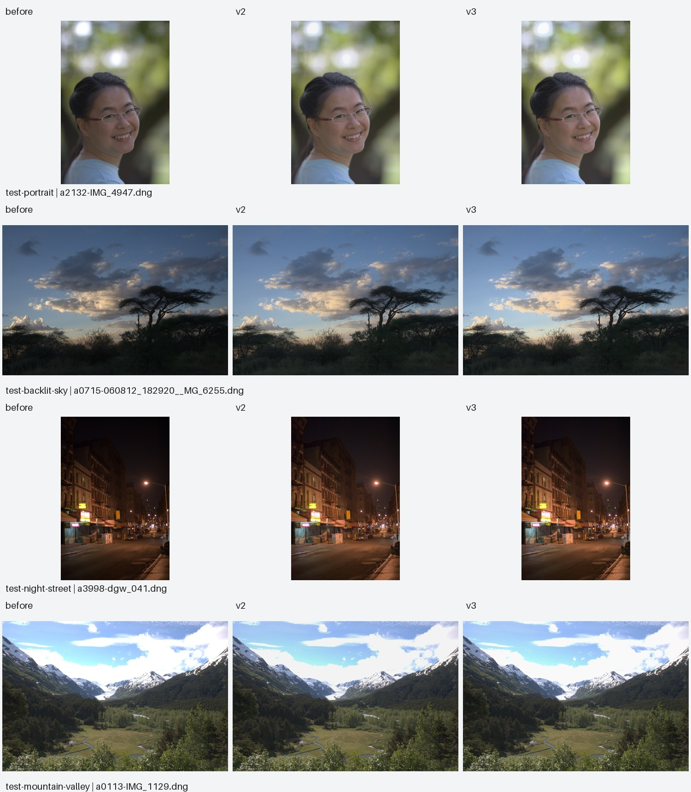

# ShotSense

A local research prototype that recommends photo adjustment parameters from unedited DNG files with valid camera white balance information, with an additional experimental JPG/JPEG input path. ShotSense combines EfficientNet-B0 semantic features with 132-dimensional linear Lab statistics to predict the arithmetic mean of five FiveK experts' parameters.

Recommendations are absolute values for legacy Camera Raw **PV2003**. `HighlightRecovery` is not modern `Highlights`. Only exposure and highlight recovery passed the recommendation gate; contrast, saturation, temperature, and tint remain experimental.

## Run locally

From the project root:

```sh
venv/bin/python -m streamlit run app/streamlit_app.py
```

Open http://127.0.0.1:8501/, upload an unedited DNG or JPG/JPEG, or select **Use project sample**. Review parameters and download JSON. Inputs are limited to 128 MB and 40 megapixels, with a 60-second timeout. The app processes one image job at a time locally.

**JPEG support is experimental.** The model was trained on DNGs; an already processed JPEG has a different input distribution. All JPEG estimates appear under experimental outputs, Temperature/Tint are unavailable, and `recommended_absolute` is empty. EXIF orientation is applied; embedded ICC profiles are converted to sRGB, with sRGB assumed when no profile is present. CMYK JPEGs require a valid ICC profile. Physical features come from linearized display sRGB, which does not undo camera/software processing. Clipped detail cannot be recovered. The baseline JPEG preview appears immediately after processing; **Apply experimental JPEG estimates to preview** is off by default. The page explicitly marks an unchanged preview and disables strength until adjustments are enabled. **Adjust JPEG preview manually** provides exposure and highlight compression controls; manual values replace model estimates for the preview. PNG/JSON downloads record the selected mode and applied settings. See [JPEG acceptance](artifacts/jpeg/ACCEPTANCE.md).

For DNG inputs, the page shows baseline RAW development and an approximate adjusted preview side by side, preserving the original aspect ratio with a maximum edge of 1600 pixels. Highlight protection is enabled by default. Adjustment strength ranges from 0–100%; applied values and clipping diagnostics appear on the page and in JSON. PNG downloads reflect the current settings. Only validated exposure and highlight compression are simulated. This custom preview is not equivalent to Lightroom and cannot guarantee recovery of clipped detail.

## Environment and reproduction

Verified on macOS arm64 with Python 3.9.8. Set up the development and training environment:

```sh
python3 -m venv venv
venv/bin/python -m pip install -r requirements.lock.txt
venv/bin/python -m pip check
venv/bin/python -m pytest -q
```

The full test suite requires the locally retained dataset and caches. Original data live in `data/raw/dngs/` and `data/raw/fivek_dataset/raw_photos/fivek.lrcat`. The Catalog is read-only, invalid labels are quarantined, and previous labels are preserved as immutable snapshots. Training requires pretrained weights at `artifacts/torch/checkpoints/efficientnet_b0_rwightman-7f5810bc.pth`; preparing those weights initially requires network access. ONNX inference runs offline.

```sh
venv/bin/python -m src.extract_labels
venv/bin/python -m src.preprocess --limit 20 --workers 1
venv/bin/python -m src.train --pilot --metadata data/processed/pilot/metadata.npz --output-dir artifacts/experiments/pilot-new --epochs 30
venv/bin/python -m scripts.prepare_data --workers 6
```

The included production bundle was trained/exported under the historical protocol. New training runs now require a **new output directory**, select checkpoints on validation P2, and produce validation results only. They do not grant validated recommendation status or replace the included bundle. A changed training seed does not change the split seed.

After reviewing photo groups and completing candidate preprocessing acceptance, use the local group map and fixed split:

```sh
venv/bin/python -m src.train --output-dir artifacts/experiments/model_vnext/control-seed42 --seed 42 --split-seed 42 --groups data/processed/model_vnext/groups.json --split-path data/processed/model_vnext/splits.json
```

Replace the run name and model seed for subsequent experiments; reuse the same group map and split. Run directories cannot be overwritten. Once architecture/settings/checkpoint selection are frozen, explicitly perform final evaluation:

```sh
venv/bin/python -m src.train --final-evaluate --output-dir artifacts/experiments/model_vnext/control-seed42
```

This creates an exclusive test-access record and refuses repeat evaluation of the same run. Training uses the training-mean constant baseline; the historical trainer used a training median. Final results do not automatically authorize promotion: three-seed comparisons, uncertainty, visual review, and deployment gates remain required. All large experimental caches/checkpoints stay local.

Caches are identified by processing-code, dependency, label, and configuration hashes. Repeated runs resume and rebuild corrupt files. Configuration changes require a new output directory or explicit `--rebuild`. Pilot and full data, splits, and models are separate. The full photo-ID split uses seed 42 and an 80/10/10 ratio. Feature standardization uses only training data. Burst/near-duplicate grouping is unavailable, so this split does not establish that all similar-scene leakage has been excluded.

## Command-line inference

```sh
venv/bin/python -m src.inference path/to/input.dng --output result.json --preview input.jpg
```

For experimental JPEG estimates:

```sh
venv/bin/python -m src.jpeg_inference path/to/input.jpeg --output result.json --preview-source preview.npz
```

JSON separates `recommended_absolute` and `experimental_absolute`, with units, legacy process semantics, model/data versions, and timing. No Delta is returned without a baseline using the same parameter version. ONNX inference does not import torch/torchvision; it still requires NumPy, ONNX Runtime, rawpy, colour-science, OpenCV, and Pillow.

## Acceptance evidence

- `data/intermediate/label_audit.json`: field sources, evidence for omitted defaults, invalid IDs, 43 repaired fields, process versions, and label hashes.
- `data/intermediate/color_audit.json`: linear/D50 configuration and pixel comparisons between shared and separate RAW contexts.
- `data/intermediate/preprocessing_benchmark.json`: throughput and peak memory for 1/2/6 workers on the same pilot.
- `data/processed/manifest.json` and `splits.json`: accounting, versions, and mutually exclusive splits. Of 5000 inputs, 4946 succeeded, 3 had invalid labels, and 51 lacked valid camera WB.
- `data/processed/input_support_audit.json`: per-file RAW-header support audit and original failure report. Unknown processing errors still fail; automatic WB is not silently enabled.
- [Model evaluation](artifacts/model/evaluation.json): constant/physical-linear/semantic/dual comparisons, final test metrics, expert disagreement, and camera/Catalog-tag/tail/As-Shot WB strata.
- [Deployment report](artifacts/model/deployment_report.json): PyTorch/ORT parity and CPU forward p50/p95, reported separately from RAW end-to-end time.

Beating a baseline on a fixed validation set is evidence of research effectiveness; acceptable error for practical use remains uncalibrated. Six parameters cannot fully reproduce expert development. Modern Lightroom mapping, faithful high-resolution development, additional RAW formats, and edited JPEG inputs are outside the verified scope. Final test macro-average error was 18.7% below the constant baseline; exposure MAE was 0.281 EV and highlight recovery MAE was 7.428. FP32 CPU forward p95 was 19.39 ms. All 26 checks passed after English localization. See [acceptance](artifacts/model/ACCEPTANCE.md) and the [master plan and development log](SHOTSENSE_MASTER_PLAN.md).

## Model improvement roadmap

The [detailed model improvement plan](MODEL_IMPROVEMENT_PLAN.md) defines grouped evaluation, validation-only experiment selection, matched baselines, aspect-preserving semantic inputs, a bounded head search, and conditional partial backbone fine-tuning. Phase A is implemented: a [production baseline manifest](artifacts/experiments/baseline_manifest.json), [reviewed grouping summary](artifacts/experiments/group_audit_summary.json), independent split/training seeds, protected run directories, and explicit final evaluation. Screening 4946 inputs proposed 11 pairs; review merged 8 and rejected 3, yielding 4938 groups. Two merged pairs crossed historical partitions. Grouping remains incomplete; a FiveK resplit is not a fresh external benchmark.

Phase B established a [reproduced grouped validation reference](artifacts/experiments/model_vnext/PHASE_B_ACCEPTANCE.md): the seed-42 dual control scored 0.277752 EV Exposure MAE and 7.108073 HighlightRecovery MAE, with P2 32.9% below the training-mean constant and 5.1% below physical linear. These are single-seed validation comparisons, separate from the production model's historical test results. Neither the new test set nor production promotion was used. See the [experiment ledger](artifacts/experiments/model_vnext/experiment_ledger.csv) and [summary](artifacts/experiments/model_vnext/phase_b_summary.json). Phase C [geometry comparison](artifacts/experiments/model_vnext/PHASE_C_ACCEPTANCE.md) is complete: letterbox dual P2 was 0.052948, 0.09% higher error than stretch. The single-seed bootstrap interval crosses zero; retain stretch geometry and skip candidate seed confirmation. Phase D [bounded head search](artifacts/experiments/model_vnext/PHASE_D_ACCEPTANCE.md) is also complete: the original configuration remained best, and its three-seed P2 mean/sample SD was 0.052239/0.000626. No alternative was promoted. Validation-only [failure analysis and partial-tuning smoke](artifacts/experiments/model_vnext/PHASE_E_SMOKE_ACCEPTANCE.md) now verify the experimental training boundaries and CPU cost. The [full three-seed comparison](artifacts/experiments/model_vnext/PHASE_E_ACCEPTANCE.md) is now complete: mean P2 improved only 0.245%, its bootstrap interval crossed zero, and only one seed improved. Retain the frozen control; no new model was promoted. White-balance/style/regional work remains pending.

## Preview development

The [preview improvement plan](PREVIEW_IMPROVEMENT_PLAN.md) records each stage. Three-photo v2 results are retained in [the v2 report](artifacts/preview_v2/acceptance.json). Current reproduction scripts call the current renderer; historical results identify their original source hashes.

The current renderer is `linear-raw-shoulder-v3`: normal midtones retain linear exposure gain, highlights use a continuous shoulder, and baseline channel-ceiling diagnostics appear in the page and JSON. These diagnostics cannot establish sensor overexposure or texture recovery. See the [16-photo v2/v3 review](artifacts/preview_v3/REVIEW.md). Reproduce with `venv/bin/python -m scripts.compare_preview_v3` after preparing local data. Browser acceptance of the latest preview remains incomplete because saved browser permissions block localhost access.



## Repository contents

The repository includes code, pinned dependencies, the master plan/development log, the production ONNX model and training checkpoint, acceptance JSON, comparison JPGs, and an English snapshot/provenance record. Original FiveK DNG/Catalog files, extracted labels, preprocessing/semantic/pretrained-backbone caches, the virtual environment, and duplicate PNG previews remain local.

The included production model can process your own supported DNG without retraining. **Use project sample** requires a DNG under local `data/raw/dngs/`. Full data tests, training, and comparison reproduction require separately prepared data and caches. `data/` audit paths and individual PNGs in reports refer to locally retained evidence.

Original historical ZIP snapshots and the initial Chinese-interface screenshot are preserved locally and in earlier Git history, rather than altered and presented as original evidence. Their hashes and purpose are recorded in [snapshot provenance](artifacts/SNAPSHOT_PROVENANCE.md). Current documentation and application text use English; prior commits remain intact.

The [optimization research review](OPTIMIZATION_RESEARCH.md) compares primary literature with the negative geometry/head/fine-tuning results and prioritizes a separate JPEG enhancement task, bounded RAW objective alignment and stronger regularized baselines. Proposed gains remain unverified.

The [dataset shortlist](DATASET_RECOMMENDATIONS.md) identifies paired FiveK, LOL, SICE, PPR10K and DPED data, including task boundaries, source-group splitting and a bounded JPEG acquisition/evaluation protocol.

The [small JPEG curve experiment](artifacts/experiments/jpeg_curve/ACCEPTANCE.md) records three-seed development gains and a visual rejection caused by amplified dark-region chroma noise. The prototype is separate from the production model and is not enabled in the app.

The [bounded-shadow regression](artifacts/experiments/jpeg_shadow_guard/ACCEPTANCE.md) tests a linear dark branch/gain cap and a separate fixed median-filter baseline. It records the visibility/noise tradeoff and remaining color/detail problems without promoting the recipe.

The [noise-aware native-crop training pilot](artifacts/experiments/jpeg_noise_v1/ACCEPTANCE.md) uses a new grouped development set, shared bounded brightness, fixed filtering and noise/detail/color losses. Numerical screens pass, but remaining grain, casts and dark visibility fail visual acceptance; the website still uses the existing release.
